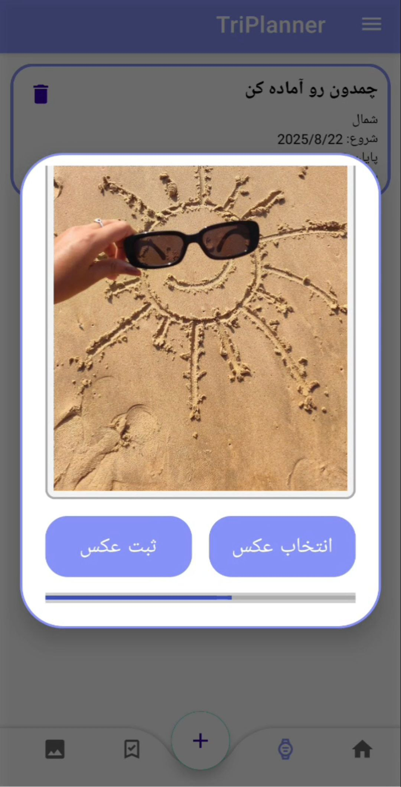
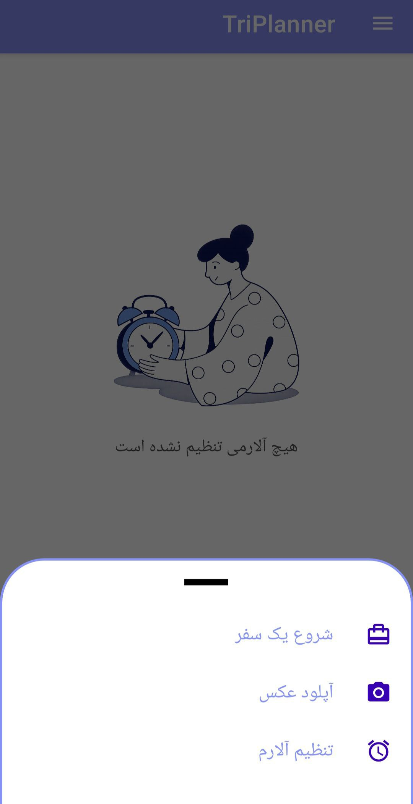
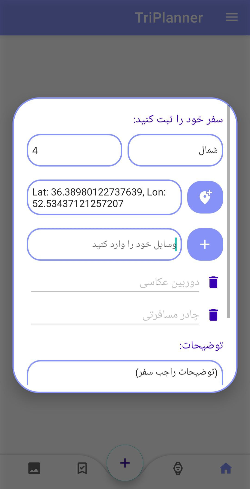
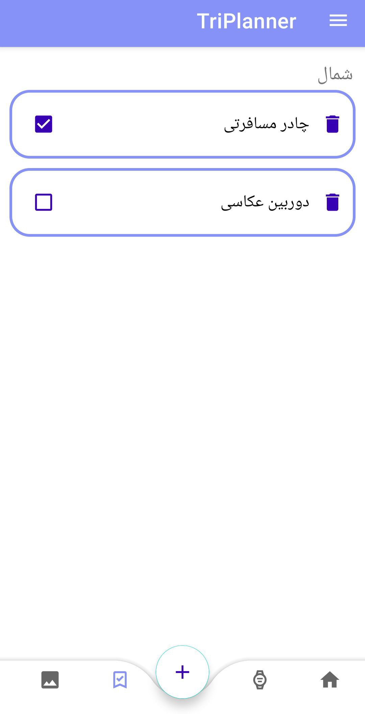
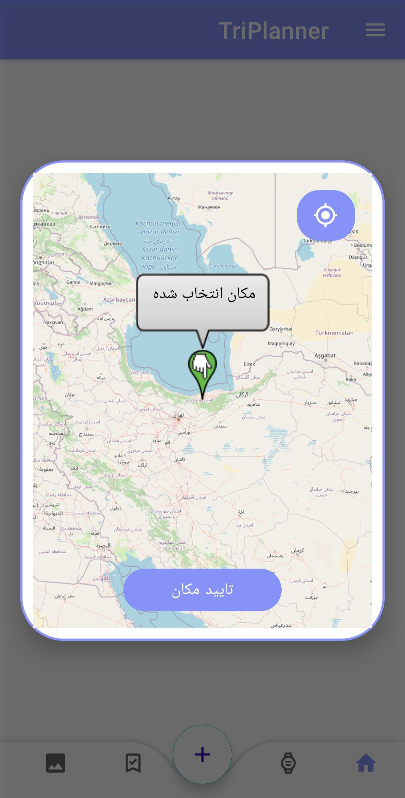
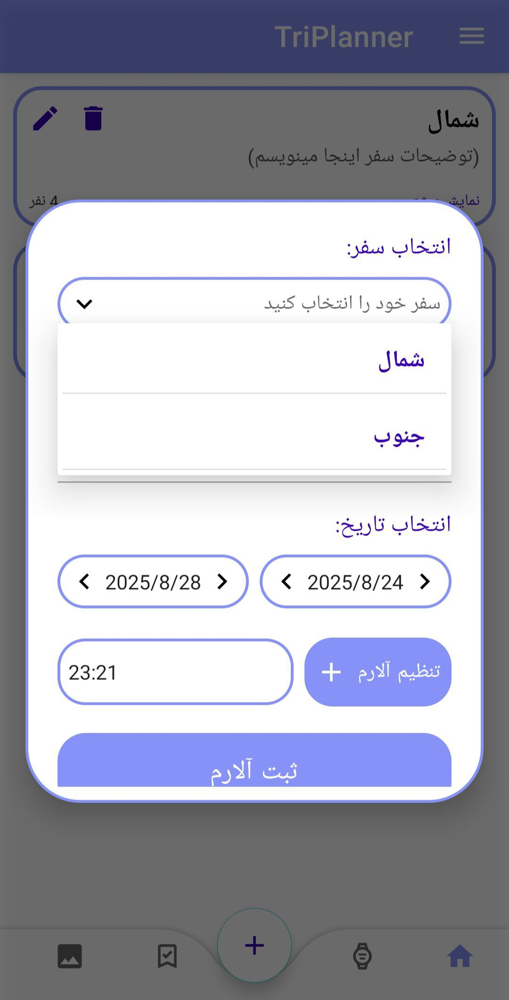

# Travel Planner — نسخه v1.0

[دانلود مستقیم APK (Release v1.0)](https://github.com/zahmadi98/TravelPlannerAPK/releases/download/v1.0/app-release.apk)  
**حجم:** 12.6 MB · **SHA-256:** `96ae3ca1e265d499841d8e2e81ca1b42bcec072031f8c12b496f1cca62db5b91`

---
## 📸 اسکرین‌شات‌ها

  
  
  
  
  

---

## ✨ معرفی کوتاه
**Travel Planner** اپی برای برنامه‌ریزی و ثبت سفرهاست. با یک رابط کاربری یوزرفرندلی می‌توانید سفرهای خود را بسازید، نفرات و مقصد را اضافه کنید، لیست وسایل و کارها درست کنید، عکس آپلود کنید و هشدار (Alarm) تنظیم کنید تا هیچ چیزی را فراموش نکنید.

در بخش «خبرها» (News) می‌توانید به سایت‌های مرتبط بروید تا بلیط تهیه کنید یا با مکان‌های گردشگری ایران آشنا شوید — همه در یک جا تا برنامه‌ریزی سفرتان ساده و لذت‌بخش شود.

---

## ✅ قابلیت‌های اصلی
- ثبت **اسم سفر** و **مقصد**  
- افزودن **نفرات همراه**  
- ساخت **دو لیست جدا** برای وسایل و کارها (برای سازماندهی بهتر)  
- نوشتن توضیحات مفصل برای هر سفر  
- **ست کردن هشدار (Alarm)** برای یادآوری کارها  
- **آپلود عکس** برای هر سفر (با نمایش تاریخ ثبت عکس)  
- **رابط کاربری یوزر فرندلی** و ساده برای استفاده روزمره  
- **بخش خبرها**: لینک به سایت‌های خرید بلیط و معرفی جاهای گردشگری ایران  
- پشتیبانی از **نقشه (Map)** برای تعیین مقصد و نمایش مسیر/مکان  
- استفاده از **Firebase** برای ورود / ثبت‌نام امن (ورود با ایمیل و رمز، ذخیره نام دلخواه)

---

## 🛠 امکانات فنی (مختصر)
- **نقشه:** انتخاب مقصد از روی مپ و پیش‌نمایش موقعیت  
- **تاریخ عکس:** هنگام آپلود عکس، تاریخ و زمان ثبت به‌صورت خودکار ثبت و نمایش داده می‌شود  
- **Authentication:** ورود/ثبت‌نام با Firebase Auth (ایمیل + رمز)، ذخیره پروفایل ساده با نام کاربری  
- **ذخیره‌سازی داده‌ها:** می‌توان از Firestore یا Realtime Database برای ذخیره سفرها، لیست‌ها و عکس‌ها استفاده کرد (نسخه‌ی تولیدی از Firebase استفاده می‌کند)

---

## 📥 نصب (برای کاربران)
1. فایل APK را از لینک بالا دانلود کنید.  
2. در دستگاه اندروید:
   - در تنظیمات → امنیت → گزینه‌ی «نصب از منابع ناشناس» (Install unknown apps) را برای مرورگر یا فایل منیجر فعال کنید.  
   - فایل APK را باز کرده و نصب کنید.  
3. اپ را باز کنید، ثبت‌نام یا ورود کنید و سفر اول خود را بسازید.

> ⚠️ اگر پیغام هشدار از Google Drive درباره‌ی اسکن ویروس دیدید: این پیام مربوط به محدودیت اسکن گوگل است و نه لزوماً نشانه‌ی بدافزار. برای اطمینان می‌توانید SHA-256 فایل را با مقدار بالا مقایسه کنید.

---

## 🔐 دسترسی‌ها (Permissions)  
اپ ممکن است برای عملکرد صحیح به دسترسی‌های زیر نیاز داشته باشد:
- دسترسی به **فضای ذخیره‌سازی** (برای آپلود / نمایش عکس)  
- دسترسی به **موقعیت مکانی** (اگر از امکانات نقشه/مقصد استفاده شود)  
- دسترسی به **اینترنت** (برای Firebase و بخش خبرها)

---

## ⚙️ برای توسعه‌دهندگان — راه‌اندازی Firebase (خلاصه)
1. در کنسول Firebase یک پروژه بسازید.  
2. اپ اندروید را اضافه کنید (package name را وارد کنید).  
3. فایل `google-services.json` را دانلود و در مسیر `app/` پروژه اندروید قرار دهید.  
4. Firebase Auth و Firestore (یا Realtime DB) و Storage را از کنسول فعال کنید.  
5. در کد، تنظیمات مربوط به Map API (مثلاً API Key گوگل مپ) را وارد کنید.

> (در صورت نیاز می‌تونم فایل README توسعه‌دهنده مفصل‌تری با قدم‌های دقیق Gradle/Android و نمونه تنظیمات ارائه بدم.)

---

## 🧾 پیشنهادات برای README در مخزن
- اضافه کردن پوشه `assets/` و قرار دادن اسکرین‌شات‌ها  
- اضافه کردن بخش `CHANGELOG.md` برای ثبت تغییرات نسخه‌ای  
- اضافه کردن `LICENSE` (مثلاً MIT یا هر لایسنس دلخواه)  
- اضافه کردن بخش **Issues** و **Contributing** برای دریافت بازخورد و همکاری

---

## 💬 تماس / پشتیبانی
- سازنده: `@zahmadi98` (GitHub)  
- اگر نیاز به کمک در تنظیم Firebase یا اصلاح README و اسکرین‌شات‌ها داشتی، بگو تا دقیق‌تر راهنمایی کنم یا README توسعه‌دهنده رو برایت آماده کنم.

